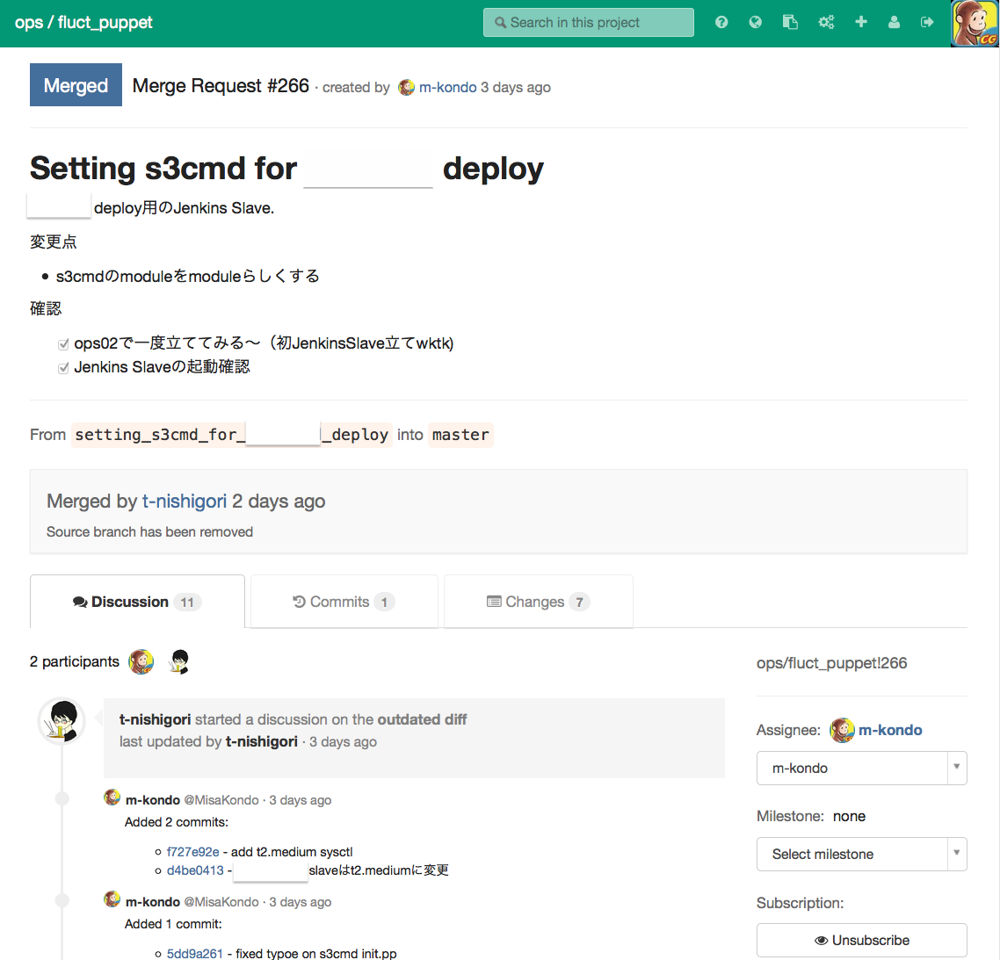
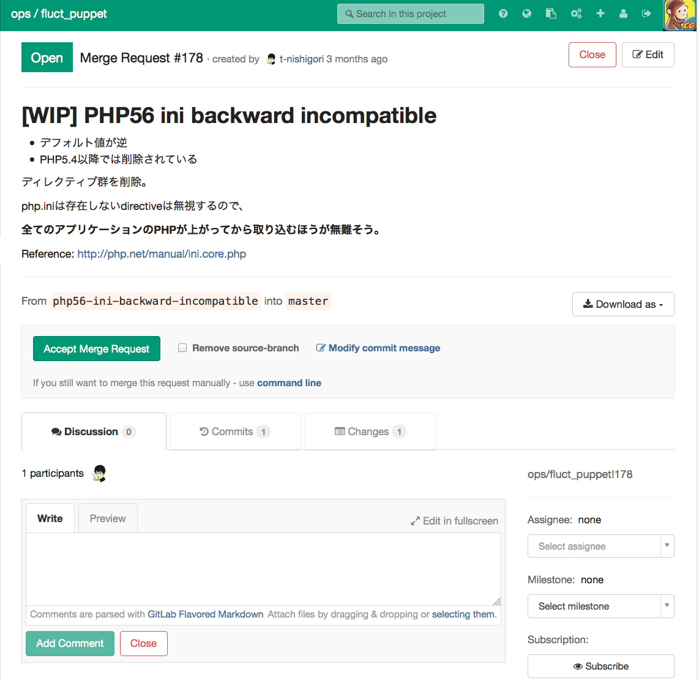
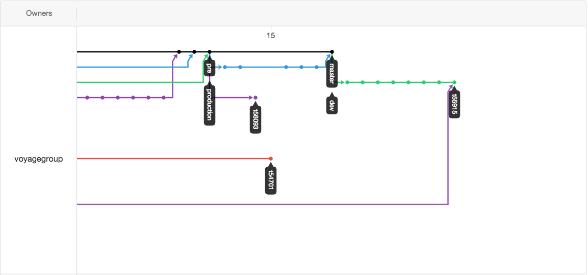

# DevOps分野でのGit活用事例

------

# 自己紹介

近藤美沙/MisaKondo/@_zoo
 - 猿のアイコン愛用しているので、だいたいそれが目印です
 - VoyageGroupという会社で、環境整備やっています
 - 業務分野的にいうとアドテク系のチームにいます
 - 好きな言語はもともとRuby、でしたが、最近Pythonも書いています

------

# そもそもDevOpsって何？

------

## 現時点だと、諸子百家

------

DevOpsはソフトウェア開発手法の一つ。
開発 (Development) と運用 (Operations) を組み合わせたかばん語であり、開発担当者と運用担当者が連携して協力する開発手法をさす。[^wikipedia]

[^wikipedia]: [Wikipedia](http://ja.wikipedia.org/wiki/DevOps)

------

DevOps is a culture shift or a movement that encourages great communication and collaboration (aka teamwork) to foster building better-quality software more quickly with more reliability [^mikekavis]

[^mikekavis]: [MikeKavis](http://www.virtualizationpractice.com/devops-engineer-25120/)

------

DevOpsとは、リーン開発およびアジャイル開発の原則に基づくソフトウェア・デリバリーの手法です。
DevOpsでは、事業部門から、開発、品質保証、および運用に至るまでのすべての利害関係者が協力して、顧客から実際に寄せられたフィードバックに基づいてソフトウェアを提供することを目的としています。[^developerworks]

[^developerworks]: [IBM developerWorks](https://www.ibm.com/developerworks/jp/devops/library/d-devops-continuous-innovation/)

------

# !? ...?

------

# 具体的にはなにやってるの？

環境構築・開発作業・テスト・リリース作業を効率化しています

------

# 本題に戻ります

------

# DevOps分野でのGit活用事例

------

## 事例1: 環境構築編

**Infrastructure as code.**

弊社では環境構築を自動化しています。
具体的には、Puppet[^puppet]というツールを利用し、定義書(以下、Manifest)に従い自動で環境を構築するようにしています。

[^puppet]: [Puppet](https://puppetlabs.com/)は、Rubyで作られている構成管理ツールです。
アプリケーション開発者には馴染みがないかもしれませんが、構成管理ツールとしてそれなりに有名ドコロです。

-------

## Manifestの管理

弊社ではPuppetのManifestをGitリポジトリ化し、レビュー体制を整えて管理しています。
具体的には、GitLab[^gitlab]というツールを利用し、管理しています。

[^gitlab]: [GitLab](https://about.gitlab.com/gitlab-com/)は、GitHubと同様の機能がほぼ実装されている、RoRで作られているOSSのsoftwareです。
弊社では機密情報はGitHubに配置しないというポリシーをとっているため、機密情報に関しては自前で建てたGitLabで管理しています。

-------

# 構成変更のユースケース

 - PHP5.3からPHP5.6にあげたい
 - OpenSSLからLibreSSLに切り替えたい
 - Jenkins欲しい
 - ApacheからNginxに変更したい
 - ApplicationのDocumentRoot変更したい

-------

# Puppeet ManifestはGitリポジトリ

 - Master=productionの構成
 - Gitにはbranchがある
 - GitLabにはMerge Requestの仕組みがある

-------

# GitLabを使った構成変更の流れ

 - リポジトリをclone
 - checkoutでbranch作成し、manifestの修正
 - branchのmanifestで環境を構築(オンプレミスのサーバだと、pxebootから、AWSのサーバだとインスタンスを新たに作る)、検証
 - 検証おわったら、Merge Request
 - LGTMもらったら、masterにmerge
 - Deploy

-------

# GitLab MergeRequest Sample1

-------

# GitLab MergeRequest Sample2

-------

## 事例2: Webアプリケーション開発編

**GitHub Flow**

弊社では複数人の開発者がWebアプリケーションの開発をしています。
アプリケーションのソースコード管理には、GitHubを利用し、開発フローにはGitHub Flow[^githubflow]を採用しています。

[^githubflow]: [GitHub Flow](https://gist.github.com/Gab-km/3705015)は、GitHubが実際に採用している開発フローです。
変更は常にレビューされ、Masterブランチは常にRelease Readyである、という思想のもとのフローです。
弊社ではGitHub Flowを開発フローとして採用しています。

-------

# 開発作業は多種多様

 - 仕様策定
 - デザイン作成
 - UnitTest
 - BrowserTest

-------

# 開発メンバーも多種多様

 - サーバサイドエンジニア
 - フロントエンドエンジニア
 - デザイナー
 - データサイエンティスト
 - インフラエンジニア

-------

# ピープル（利用者）の意見が欲しい、他作業者との共同作業で動作確認したい

 - Localhost(例： 自分のMacで動いているVirtualBox,もしくはMac上で動いている環境)だと人にみせづらい
 - 開発の度に複数人が動作確認できる環境を構築するのは手間
 - サーバサイド×フロントエンド×デザイナーの共同作業

-------

# VirtualHost環境利用

 - branchである特定のprefixを付与すると、自動でVirtualHost[^virtualhost]環境が作成される
 - 開発者は、動作確認を他の人にもしてほしくなったら、GitHubに特定のブランチ名でpushすれば環境ができる

[^virtualhost]: [VirtualHost](http://ja.wikipedia.org/wiki/%E3%83%90%E3%83%BC%E3%83%81%E3%83%A3%E3%83%AB%E3%83%9B%E3%82%B9%E3%83%88)は1つのサーバで複数のドメインを運用する技術。

-------

# GitHub  Sample1

-------

# 最後に

今回の資料はGitHubのPublicリポジトリで公開しています。

勉強会後にでも気になった部分や、質問などあれば、ISSUEで起票してくれると嬉しいです。

資料に対して、紹介したい事例とかある人がいれば、PullRequest大歓迎です。(自分得）

資料にtypo見つけたので、直してくれるとかも大歓迎です。

-------

# 現状確認

[TODO](https://github.com/MisaKondo/pyladies_meetup/blob/master/TODO.md)

-------

# ご清聴ありがとうございました

